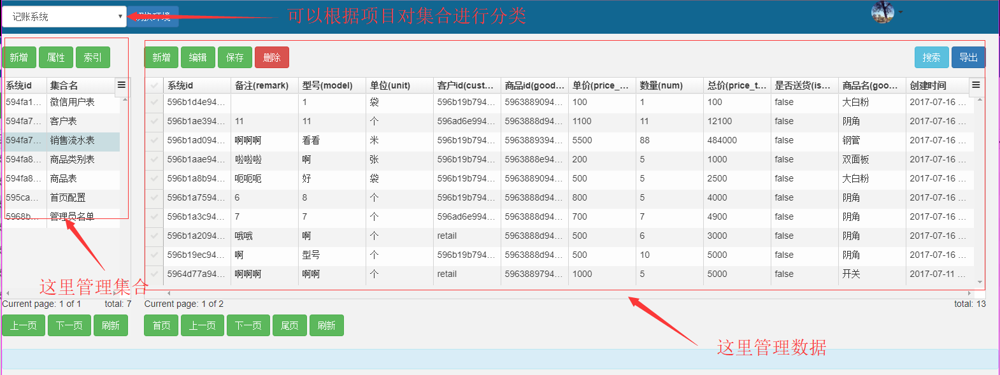
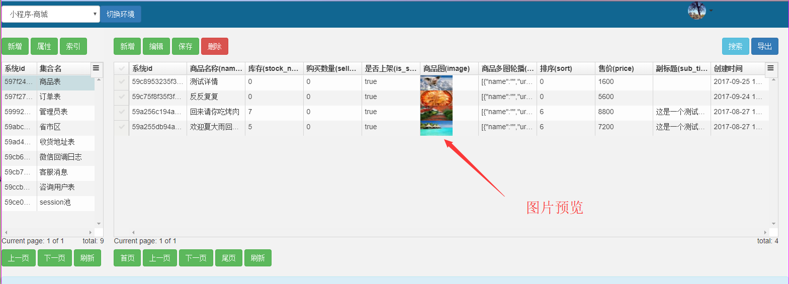
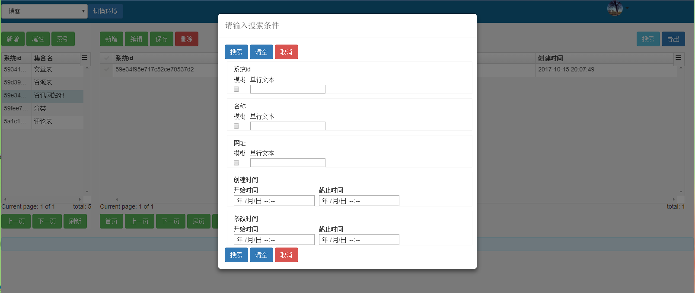
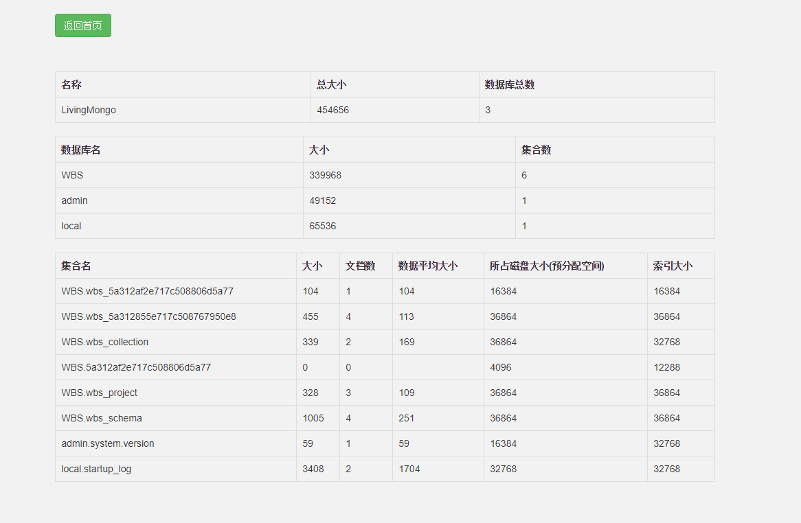
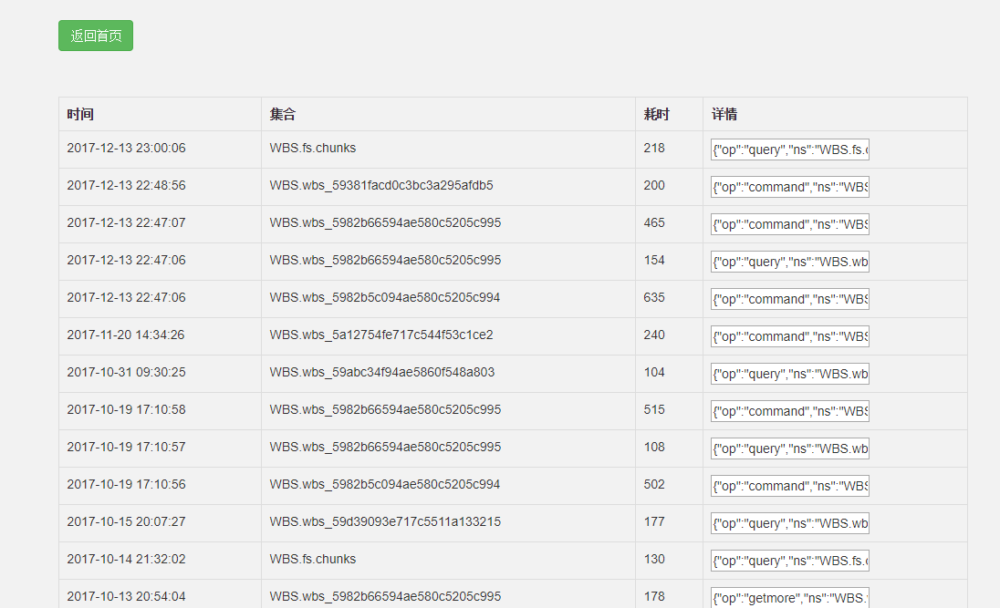

# MongoDB GUI - LivingMongo
LivingMongo是一个mongodb数据库的GUI操作系统，支持对数据`字段的修改`、`数据搜索`、`集合的分类`、`索引管理`、`空间统计`、`慢查询`等

demo地址 : [http://living-mongo.kupposhadow.com](http://living-mongo.kupposhadow.com "http://living-mongo.kupposhadow.com")

使用介绍 : [开源MongoDB GUI - LivingMongo](https://www.kupposhadow.com/post/5a31418fe717c521e26e7649 "开源MongoDB GUI - LivingMongo")

github : [https://github.com/swimmingwhale/living-mongo](https://github.com/swimmingwhale/living-mongo "https://github.com/swimmingwhale/living-mongo")

# 运行环境
- PHP >= 7.0
- MongoDB >= 3.4.2

# 数据管理


# 图片预览


# 数据搜索


# 空间统计


# 慢查询统计



## docker一键安装测试
```shell
docker pull swimmingwhale/living-mongo
docker run -dt --name living-mongo -p 80:80 swimmingwhale/living-mongo
```
容器内包含了nginx,php,mongodb等所有运行所需的软件.启动容器后就可以通过访问服务器ip的方式访问该项目.如果你是在window上运行的docker可以直接在浏览器访问http://127.0.0.1


如果你的80端口被占用,可以使用其他端口,如
```shell
docker run -dt --name living-mongo -p 8110:80 swimmingwhale/living-mongo
```
这样你需要访问ip:8110


